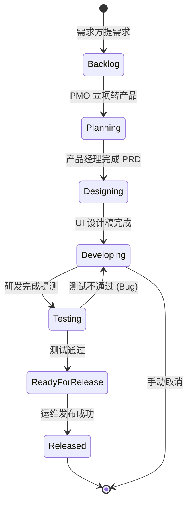

# 技术部门任务分发流转体系 · 业务与技术架构

> 本文档详细阐述「技术部门 (Tech Dept)」项目如何从**业务研发制度**到**代码实现细节**，完整处理复杂多 Agent 协作的任务分发与流转。这是一个**制度化的 AI 多 Agent 研发框架**，而非传统的自由讨论式协作系统。

**文档概览图**

```
━━━━━━━━━━━━━━━━━━━━━━━━━━━━━━━━━━━━━━━━━━━━━━━━━━━━━━━━━━━━━
业务层：敏捷研发制度 (Agile R&D Model)
  ├─ 岗位分工：需求方 → PMO → 产品 → UI → 研发 → 测试 → 运维
  ├─ 制度约束：阶段严格递进、质量红线、测试必验收
  └─ 效能保障：自动化流转、实时可观测、紧急可干预
━━━━━━━━━━━━━━━━━━━━━━━━━━━━━━━━━━━━━━━━━━━━━━━━━━━━━━━━━━━━━
技术层：OpenClaw 多 Agent 编排 (Multi-Agent Orchestration)
  ├─ 状态机：7个核心状态（Backlog → Planning → Designing → Developing → Testing → ReadyForRelease → Released）
  ├─ 数据融合：flow_log + progress_log + session JSONL → unified activity stream
  ├─ 权限矩阵：严格的 subagent 调用权限控制
  └─ 调度层：自动派发、超时重试、停滞升级、自动回滚
━━━━━━━━━━━━━━━━━━━━━━━━━━━━━━━━━━━━━━━━━━━━━━━━━━━━━━━━━━━━━
观测层：React 看板 + 实时 API (Dashboard + Real-time Analytics)
  ├─ 研发看板：10个视图面板（看板/监控/归档/模板等）
  ├─ 活动流：高频混合活动记录（思考过程、工具调用、状态转移）
  └─ 在线状态：Agent 实时节点检测 + 心跳唤醒机制
━━━━━━━━━━━━━━━━━━━━━━━━━━━━━━━━━━━━━━━━━━━━━━━━━━━━━━━━━━━━━
```

---

## 📚 第一部分：业务架构

### 1.1 研发制度：职责分工的设计哲学

#### 核心理念

传统的多 Agent 框架（如 CrewAI、AutoGen）采用**"自由协作"模式**，容易出现 Agent 相互制造假数据、重复工作、方案质量无保障等问题。

**技术部门系统**采用**"制度化协作"模式**，模仿现代互联网公司的敏捷研发体系：

```
              需求方
              (User)
               │
               ↓
             PMO (pmo)
        [入口管理、需求分拣]
      ├─ 识别：这是真实研发需求还是闲聊？
      ├─ 执行：创建项目 (PRJ) -> 转产品经理
      └─ 权限：只能调用 产品经理 (product)
               │
               ↓
           产品经理 (product)
        [需求分析、规划中枢]
      ├─ 编写 PRD (产品需求文档)
      ├─ 拆解为子任务 (todos)
      ├─ 协调 UI、研发团队
      └─ 权限：只能调用 UI + 前端 + 后端 + 测试
               │
               ↓
           UI 设计师 (ui)
        [视觉设计、交互规范]
      ├─ 输出高保真 HTML 原型
      ├─ 产出设计规范文档
      └─ 权限：交付给产品经理或前端工程师
               │
               ↓
           研发团队 (frontend/backend)
        [代码实现、接口联调]
      ├─ 前端 (fe)：页面开发、UI 还原
      ├─ 后端 (be)：业务逻辑、API 开发
      └─ 权限：完成后提测
               │
               ↓
           测试工程师 (qa)
        [质量把控、验收守门人]
      ├─ 编写测试用例、执行测试
      ├─ 发现 Bug 打回研发 (Developing)
      ├─ 验收通过转运维 (ReadyForRelease)
      └─ 权限：只能调用 运维 + 回调研发
               │
         (✅ 验收通过)
               │
               ↓
           运维工程师 (ops)
        [环境部署、发布上线]
      ├─ 执行 CI/CD 流水线、生产部署
      ├─ 监控上线状态 -> 产出上线报告
      └─ 权限：汇报给 PMO 结项
               │
               ↓
           PMO·项目结项
      ├─ 归档项目日志
      ├─ 回复需求方：功能已上线
      └─ 状态转为 Released (Done)
```

#### 制度的 4 大保障

| 保障机制 | 实现细节 | 防护效果 |
|---------|---------|---------|
| **阶段审核** | 测试工程师必验收所有研发产出 | 防止代码胡乱上线，确保功能符合 PRD |
| **权限矩阵** | 谁能调谁严格定义 | 防止流程越权（如研发直接跳过测试上线） |
| **完全可观测** | 研发看板 10 个面板 + 实时活动流 | 实时看到项目卡在哪、哪个岗位在处理 |
| **实时可干预** | 看板内一键停止/取消/推进 | 紧急情况（如发现需求变更）能立即纠正 |

---

### 1.2 任务完整流转流程

#### 流程示意图



---

## 🔧 第二部分：技术架构

### 2.1 状态机与自动派发

#### 状态转移完整定义

每个状态自动关联 Agent ID（见 `_STATE_AGENT_MAP`）：

```python
_STATE_AGENT_MAP = {
    'Backlog': 'pmo',
    'Planning': 'product',
    'Designing': 'ui',
    'Developing': 'frontend', # 或 backend
    'Testing': 'qa',
    'ReadyForRelease': 'ops',
}
```

#### 自动派发流程

当任务状态转移时，后台自动执行异步派发，促使对应的岗位 Agent 立即开始工作。

---

### 2.2 权限矩阵与 Subagent 调用

#### 权限定义 (openclaw.json)

```json
{
  "agents": [
    { "id": "pmo", "allowAgents": ["product"] },
    { "id": "product", "allowAgents": ["ui", "frontend", "backend", "qa"] },
    { "id": "ui", "allowAgents": ["product", "frontend"] },
    { "id": "qa", "allowAgents": ["frontend", "backend", "ops"] }
  ]
}
```

---

### 2.3 数据融合：进展日志 + 会话活动

系统实时融合三层数据：
1. **flow_log**: 记录状态转移（如：Planning → Designing）。
2. **progress_log**: Agent 的主动汇报（包含子任务进度、资源消耗）。
3. **session activity**: 自动抓取 Agent 的**内心独白 (thinking)**、**工具调用**及**报错信息**。

---

## 📊 第三部分：研发看板与监控

看板提供 10 个核心视图面板，帮助项目负责人实时掌握研发进度：
- **Kanban 看板**: 核心流转视图。
- **岗位调度**: 监控各岗位活跃度与 Token 消耗。
- **项目归档**: 自动生成已完成项目的全生命周期回顾。
- **模型配置**: 一键热切换各岗位的 LLM 引擎。

---

## 📋 总结

**技术部门协作系统是一个制度化的 AI 研发体系**。它通过：
1. **业务层**: 建立职责分明、分权制衡的岗位结构。
2. **技术层**: 状态机 + 权限矩阵 + 自动派发，确保流程可控。
3. **观测层**: 实时看板 + 深度活动流，消除 AI 协作的“黑盒”感。

相比传统的“自由协作”，它提供了一套更适合企业级软件开发的 AI 协作标准。
