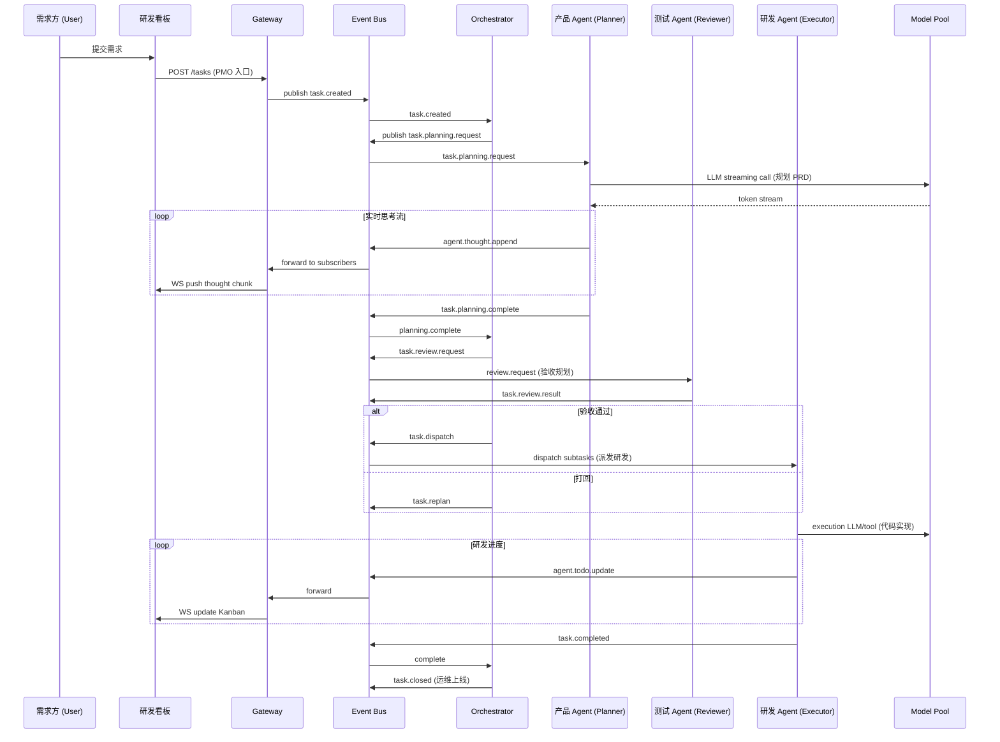

# 技术部门 Agent 架构重设计文档 (Tech Dept)

## 1. 设计目标
- **可观测性**：研发看板能实时显示每个岗位 Agent 的思考流 (Thoughts) 和 Todo 变更。
- **可重放与审计**：所有研发事件和状态变更持久化，可回溯。
- **可控流程**：保留现代研发流转逻辑，事件驱动，支持人工干预。
- **实时与可扩展**：低延迟交互，支持水平扩展岗位 Agent。
- **结构化任务与可插拔 Skill**：Todo 与思考结构化，便于 UI 渲染和复用。

## 2. 总体组件
1. **API Gateway / Control Plane**（REST + WebSocket）
2. **Orchestrator（调度核心）**
3. **Event Bus / Stream Layer**（Redis Streams / NATS / Kafka）
4. **Agent Runtime Pool**（包含 PMO, 产品, 研发, 测试, 运维等岗位）
5. **Model / LLM Pool**
6. **Task Store / Audit DB**（Postgres + JSONB）
7. **Realtime Dashboard**（WebSocket 客户端）
8. **Observability / Tracing**（Prometheus + Grafana + OpenTelemetry）

## 3. 通信模式
- **Event-Driven**: 所有 Agent 间通信通过 Event Bus。
- **主题示例**: `task.created` (PMO立项), `task.planning` (产品规划), `task.review.request` (提测), `task.review.result` (验收结果), `task.dispatch` (派发研发), `agent.thoughts`, `agent.todo.update`, `task.status`, `heartbeat`

---

## 4. 协作逻辑与时序 (Mermaid)

---

## 5. 技术栈建议
| 层 | 技术 |
|----|------|
| Event Bus | Redis Streams |
| API | FastAPI |
| WS | FastAPI WebSocket |
| DB | Postgres |
| Agent Runtime | Python asyncio worker |
| Frontend | React + Zustand |

---
**备注**：此文档为技术部门系统的架构设计，包含事件规范、WebSocket 协议和岗位协作时序，用于实现高可观测性的 AI 研发团队。
